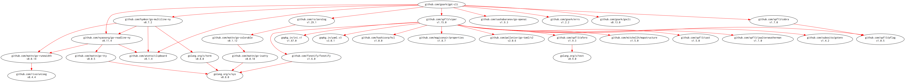

# [gpt-cli] CLI tool for GPT with OpenAI API

[](https://github.com/goark/gpt-cli/actions)
[](https://github.com/goark/gpt-cli/actions)
[](https://raw.githubusercontent.com/goark/gpt-cli/master/LICENSE)
[](https://github.com/goark/gpt-cli/releases/latest)

This package is required Go 1.20 or later.

## Build and Install

```
$ go install github.com/goark/gpt-cli@latest
```

### Binaries

See [latest release](https://github.com/goark/gpt-cli/releases/latest).

## Usage

```
$ gpt-cli -h
CLI tool for GPT with OpenAI API.

Usage:
  gpt-cli [flags]
  gpt-cli [command]

Available Commands:
  chat        Chat with GPT-x
  help        Help about any command
  version     Print the version number

Flags:
      --api-key string     OpenAI API key
      --config string      Config file (default /home/username/.config/gpt-cli/config.yaml)
      --debug              for debug
  -h, --help               help for gpt-cli
      --log-dir string     Directory for log files (default "/home/username/.cache/gpt-cli")
      --log-level string   log level [nop|error|warn|info|debug|trace] (default "nop")

Use "gpt-cli [command] --help" for more information about a command.
```

### Chat with GPT-x

```
$ gpt-cli chat -h
Chat with GPT-x, input from standard input.

Usage:
  gpt-cli chat [flags]

Aliases:
  chat, c

Flags:
  -c, --clipboard          Input message from clipboard
  -h, --help               help for chat
  -i, --interactive        Interactive mode
  -p, --profile string     Path of profile file (JSON format)
  -f, --save-file string   Path of save file (JSON format)

Global Flags:
      --api-key string     OpenAI API key
      --config string      Config file (default /home/username/.config/gpt-cli/config.yaml)
      --debug              for debug
      --log-dir string     Directory for log files (default "/home/username/.cache/gpt-cli")
      --log-level string   Log level [nop|error|warn|info|debug|trace] (default "nop")
```

### Input form Standard input

```
$ echo hello | gpt-cli c --api-key "your-api-key"
Hello! How can I help you today?

save to /home/username/.cache/gpt-cli/chat.2133582955.json
```

### Interactive mode

```
$ gpt-cli c -i --api-key "your-api-key"

Chat> こんにちは

こんにちは！私はAIのアシスタントです。何かお手伝いできることがありますか？

Chat> 科学雑誌の日経サイエンスにChatGPTの特集が載るそうです。どんな内容になるか予想してみましょう。

ChatGPTとは、人工知能による自然言語処理を利用した対話型のチャットボットです。日経サイエンスがChatGPTに特集を組むことから、以下のような予想が考えられます。

1. ChatGPTの機能や特徴の紹介
ChatGPTの性能、動作原理などの詳しい解説や、どのような機能があるのか、どのような場面で活躍するのかなどが紹介される可能性があります。

2. ChatGPTの応用例の紹介
ChatGPTが活用される応用例として、カスタマーサポート、医療支援、人工知能アシスタントなどがあります。特集では、ChatGPTがどのようにこれらの分野で活躍しているのか、具体例を交えて解説されるかもしれません。

3. ChatGPTの進化と今後の展望について
ChatGPTは、自然言語処理分野での革新的な技術であり、今後、ますます進化していくことが期待されています。特集では、今後どのような改良がされ、また、普及の度合いがどこまで広がるのか、その展望についても取り上げられるかもしれません。

Chat> ありがとうございます。雑誌を読むのが楽しみです

どういたしまして。日経サイエンスは、科学技術に関する話題や最新の研究成果などが掲載され、とても興味深く読める雑誌ですね。ChatGPTに特集が組まれるということで、ますます注目が集まりそうですね。楽しみにしていてください。

Chat> q

save to /home/username/.cache/gpt-cli/chat.2788390222.json
```

## Configuration to $XDG_CONFIG_HOME/gpt-cli/config.yaml file

```yaml
api-key: your_api_key_string
log-dir: /var/log/gpt-cli
log-level: info
```

## Modules Requirement Graph

[](./dependency.png)

## Reference

- [OpenAI API](https://platform.openai.com/docs/)
- [sashabaranov/go-openai: OpenAI ChatGPT, GPT-3, GPT-4, DALL·E, Whisper API wrapper for Go](https://github.com/sashabaranov/go-openai)

[gpt-cli]: https://github.com/goark/gpt-cli "goark/gpt-cli: CLI tool for GPT with OpenAI API"
